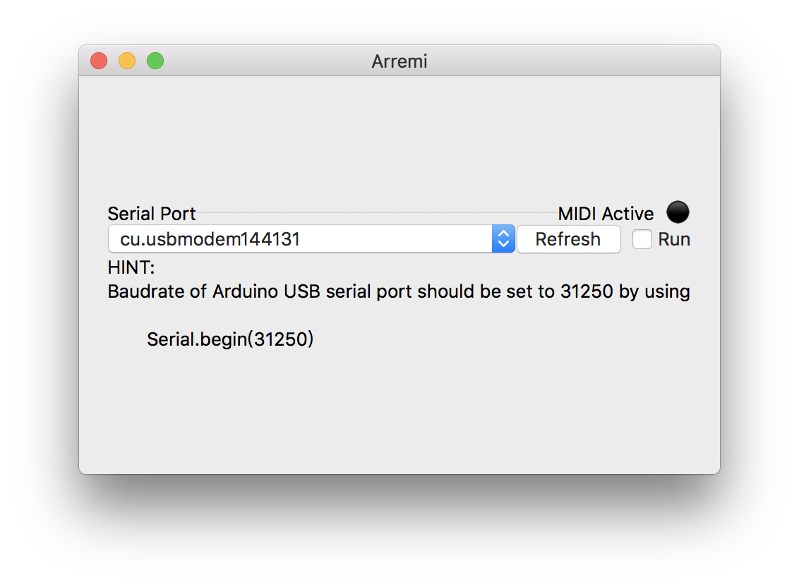

Arremi
=====

Arremi is a simple driver/router from Arduino USB serial to MIDI

**Linux support not completed yet! debug needed.**

## Build
just run `build.sh` and find app(mac) or tgz(linux) in `build` folder.